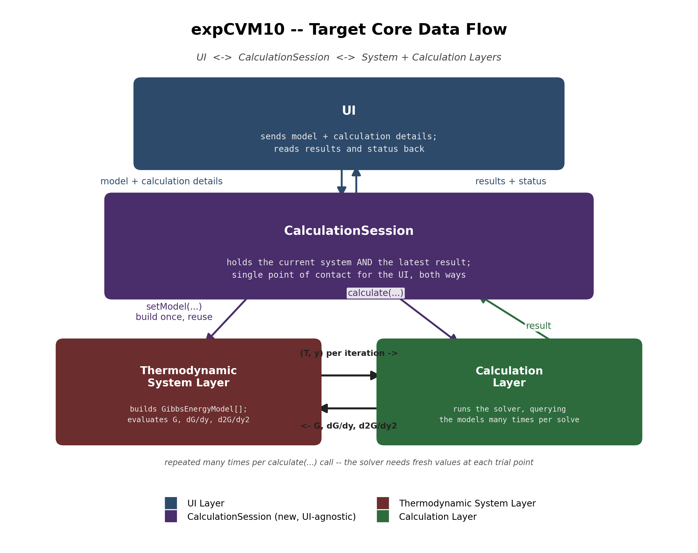
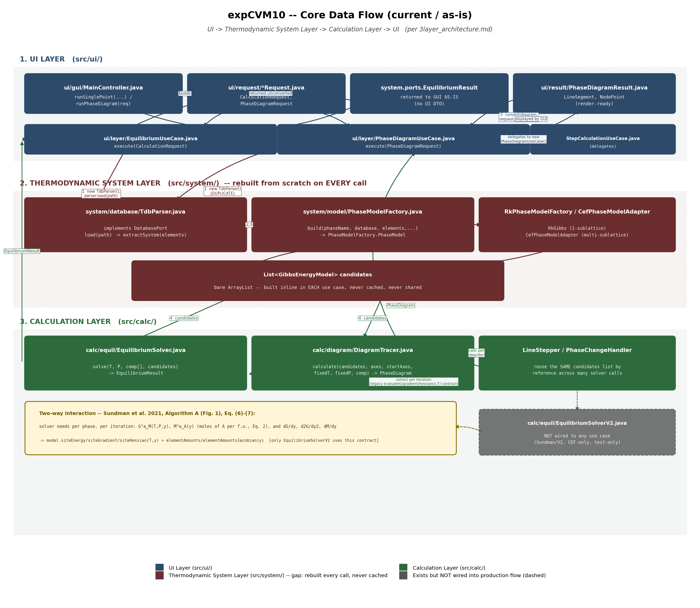
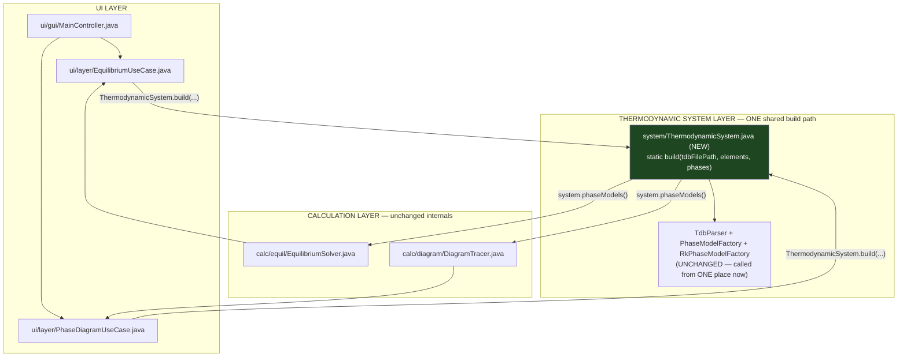
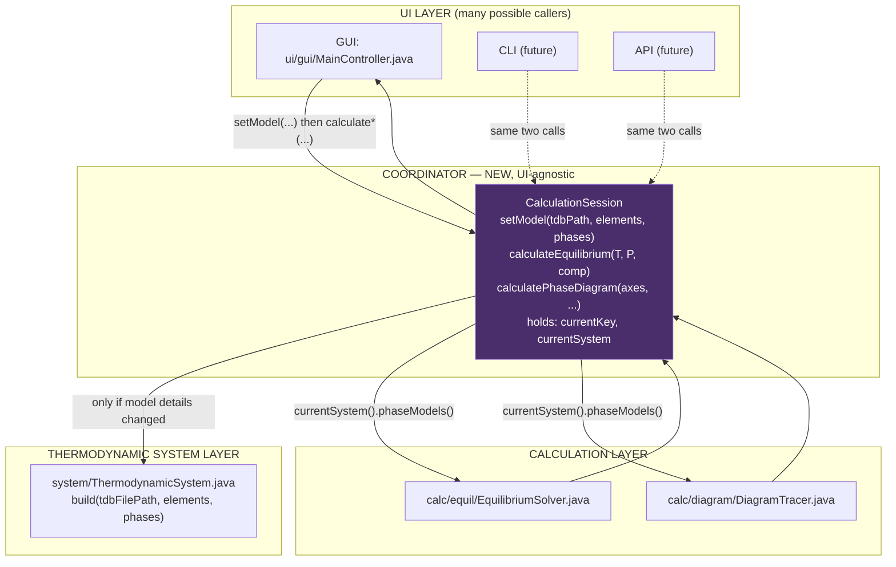

# Implement the documented Core Data Flow (UI → System → Calculation → UI)

## Context

The target flow (documented in `README.md` under "Structure"): the UI
turns user input into a **problem object**; a **Thermodynamic System
Layer** is activated once to parse the database and build phase models,
forming a **thermodynamic system** that remains fixed throughout the
calculation; this system plus the problem object go to a **Calculation
Layer** that runs a solver in a two-way loop against the system, and
finally produces a **result object** that flows back to the UI (landing
on `CalculationSession`, which the UI reads from).

Investigation of the existing code found it's closer to this target than a
from-scratch design would suggest:
- Problem-object DTOs already exist (`CalculationRequest`, `PhaseDiagramRequest`).
- `RkGibbs`/`CefPhaseModelAdapter` (via `GibbsEnergyModel`) already are the
  "Gibbs Model Sub-layer," providing `siteEnergy`/`siteGradient`/`siteHessian`
  — built once, immutable.
- `EquilibriumSolver.solve(T, P, comp[], List<GibbsEnergyModel>)` already has
  the right shape for a Calculation Layer module.
- `PhaseDiagramUseCase` already converts its internal result graph to a
  UI-facing DTO (`PhaseDiagramResult`) before returning.

**The one concrete gap: no persistent "Thermodynamic System" object.**
`EquilibriumUseCase.execute()` and `PhaseDiagramUseCase.execute()` each
independently did `new TdbParser()` → `load()` → `extractSystem()` →
`buildPhaseModels()` → wrap as `GibbsEnergyModel` — the same five steps,
duplicated, with no caching, reparsing the TDB from disk on every call even
back-to-back. `DiagramTracer` does reuse one phase-model list across many
solver calls internally, but only for the lifetime of one `execute()` call,
never across independent calculations. Steps 1-2 below close this gap.

**Sundman grounding.** The two-way System↔Calculation interaction is
Sundman, Dupin & Hallstedt, *"Algorithms useful for calculating
multi-component equilibria, phase diagrams and other kinds of diagrams,"*
CALPHAD 75 (2021) 102330 — specifically Algorithm A (Fig. 1) and the
Lagrangian Eq. (6)-(7), which require **G_M^α(T,P,y)**, **M_A^α(y)** (Eq. 2),
and their y-derivatives, evaluated per phase at every iteration. That exact
contract (`siteEnergy`/`siteGradient`/`siteHessian`/`elementAmounts`/
`elementAmountsJacobian` on `GibbsEnergyModel`) is implemented today **only
by `EquilibriumSolverV2`**, which is not wired into any use case — the
production `EquilibriumSolver` uses an older `evaluateG`/`gradient`/
`hessian(x,T)` contract instead. Consequence: everything here must stay
solver-agnostic, since the two solvers query models through different
contracts and only one is Sundman's Algorithm A as published.

Sundman's Algorithms B/C1/C2 (step/mapping state machine: nodes with exits,
line-following, phase-change-triggered node creation) and the grid
minimizer (§2.3.3, initial stable-phase-set guess before Newton iteration)
were also checked against this codebase — see Step 5.

## Target data flow (current design)



*(Generated by `docs/gen_target_dataflow_figure.py`; re-run and re-embed
after any structural change.)*

- **UI ↔ `CalculationSession` is two-way, one relationship.** The UI sends
  model details and calculation details; it reads results and status back.
  It never talks to `ThermodynamicSystem` or a solver directly.
- **Results flow into `CalculationSession`, not back to the caller.** The
  Calculation Layer hands its result to the session, which holds it
  alongside the current system; the UI reads it from there
  (`currentResult()`). This is why `calculateEquilibrium(...)`/
  `calculatePhaseDiagram(...)` below are `void`.
- **System Layer ↔ Calculation Layer is a real, repeated, two-way loop**
  within one `calculate(...)` call, not a one-time handoff of
  `GibbsEnergyModel[]`. Every Newton iteration is a fresh `(T, y)` query
  answered with fresh `G, dG/dy, d2G/dy2` — the System Layer holds no state
  between calls.

<details>
<summary>Superseded sketches (as-is figure, earlier revisions) — kept for history</summary>

### Current (as-is) data flow



*(Generated by `docs/gen_dataflow_figure.py`.)*

### Revision 1 — after Steps 1-2 only (no cross-call reuse yet)



### Revision 2 — first `CalculationSession` sketch (results returned directly, no repeated loop shown)



</details>

## Approach

Introduce two new coordinating classes and refactor two existing use cases
to route through them — no change to any solver, model, or database class.

### Step 1 — `ThermodynamicSystem`  ✅ DONE

```java
public final class ThermodynamicSystem {
    private final List<String> elements;
    private final List<GibbsEnergyModel> phaseModels;  // built once, immutable

    private ThermodynamicSystem(List<String> elements, List<GibbsEnergyModel> phaseModels) { ... }

    /** The ONE place that does TdbParser -> extractSystem -> buildPhaseModels
     *  -> wrap as GibbsEnergyModel. */
    public static ThermodynamicSystem build(String tdbFilePath,
                                             List<String> elements,
                                             List<String> phases) throws IOException { ... }

    public List<GibbsEnergyModel> phaseModels() { return phaseModels; }
    public List<String> elements() { return elements; }
}
```

Implemented at `src/system/ThermodynamicSystem.java`, matching this sketch
(private constructor; `build()` is the only way to create one). Verified:
whole-project compile clean; existing baseline tests unaffected
(`CefLiteratureBaselineTest`, `EMatNCTest`).

**Bug found and fixed along the way:** `PhaseDiagramUseCase.execute()` cast
`List<PhaseModelFactory.PhaseModel>` straight to `List<GibbsEnergyModel>` —
`PhaseModel` doesn't implement that interface, so this would have thrown
`ClassCastException` on first real use. `ThermodynamicSystem.build()` now
does the correct `pm.toGibbsModel(elements)` unwrap for both use cases.

### Step 2 — Wire `EquilibriumUseCase`/`PhaseDiagramUseCase` through it  ✅ DONE

Both `execute()` methods now call `ThermodynamicSystem.build(...)` instead
of duplicating the five-step block, then pass `system.phaseModels()` into
the existing solver/tracer calls unchanged. Purely mechanical,
behavior-preserving. `StepCalculationUseCase` needs no change — it inherits
the fix by delegating to `PhaseDiagramUseCase`.

### Step 3 — `CalculationSession`: model/calculation lifecycle, reusable across UIs  ✅ DONE

Steps 1-2 only satisfy "built once, remains fixed" for one `execute()`
call. The actual requirement: the UI sends **model details** (database,
elements, phases) and, separately, **calculation details** (type,
parameters); the resulting `ThermodynamicSystem` should be **reused across
multiple calculations** as long as model details haven't changed. A new
class, `CalculationSession`, owns this lifecycle and is the single choke
point every caller — GUI, future CLI, future API — goes through, in both
directions (see topology notes above: results land on the session, not the
caller; UI↔session is two-way; System↔Calculation loops repeatedly per
calculation).

```java
package session;   // new top-level source root, sibling to ui/, system/, calc/

public final class CalculationSession {

    public record ModelKey(String tdbFilePath, List<String> elements, List<String> phases) {}

    private ModelKey currentKey;
    private ThermodynamicSystem currentSystem;
    private EquilibriumResult currentEquilibriumResult;
    private PhaseDiagram currentPhaseDiagram;

    /** Rebuilds ONLY if key differs from the currently held one. */
    public void setModel(String tdbFilePath, List<String> elements, List<String> phases)
            throws IOException {
        ModelKey requested = new ModelKey(tdbFilePath, elements, phases);
        if (requested.equals(currentKey)) return;
        this.currentSystem = ThermodynamicSystem.build(tdbFilePath, elements, phases);
        this.currentKey = requested;
        this.currentEquilibriumResult = null;   // old results invalid for a new system
        this.currentPhaseDiagram = null;
    }

    public boolean hasModel() { return currentSystem != null; }

    public ThermodynamicSystem currentSystem() {
        if (currentSystem == null)
            throw new IllegalStateException("No model set -- call setModel() first");
        return currentSystem;
    }

    /** Stores the result; does not return it. Internally calls back into the
     *  held GibbsEnergyModel instances once per Newton iteration. */
    public void calculateEquilibrium(double T, double P, double[] compOverAll) {
        this.currentEquilibriumResult =
                new EquilibriumSolver().solve(T, P, compOverAll, currentSystem().phaseModels());
    }

    public void calculatePhaseDiagram(AxisConfig[] axes, double[] startAxes,
                                       double fixedT, double fixedP, double[] comp) {
        this.currentPhaseDiagram = new DiagramTracer().calculate(
                currentSystem().phaseModels(), axes, startAxes, fixedT, fixedP, comp);
    }

    /** NOT YET IMPLEMENTED -- see "Four calculation types" note below. */
    public void calculateStep(AxisConfig axis, double fixedT, double fixedP, double[] comp) {
        currentSystem();
        throw new UnsupportedOperationException("Step calculation not yet implemented");
    }

    /** NOT YET IMPLEMENTED -- see "Four calculation types" note below. */
    public void calculateMap(AxisConfig axis0, AxisConfig axis1,
                              double fixedT, double fixedP, double[] comp) {
        currentSystem();
        throw new UnsupportedOperationException("Map calculation not yet implemented");
    }

    /** Latest equilibrium result, or null if none has completed / it was
     *  superseded by a new setModel() call. */
    public EquilibriumResult currentEquilibriumResult() { return currentEquilibriumResult; }

    /** Latest phase-diagram result, or null (same rules as above). */
    public PhaseDiagram currentPhaseDiagram() { return currentPhaseDiagram; }
}
```

**Four calculation types, not two (decided 2026-09-10):** single point,
step, map, and phase diagram are four distinct calculation types — step and
map are property scans (sample the equilibrium over 1 or 2 axes, no
phase-boundary tracking), while phase diagram is a materially more complex
calculation (Sundman's Algorithms B/C1/C2 — node/exit graph, ZPF
line-following, phase-change detection; see Step 5). Investigation found
step/map have **no working plain-sampling engine in this codebase today** —
the only existing step/map code is inside `DiagramTracer`
(`calculateStep`/`calculateMap` methods), and it always does full
phase-boundary tracing, never simple point sampling. `PropertyScanRequest`
(the DTO shape for a lightweight step/map) exists but is entirely unwired —
`MainController.runPropertyScan` is a stub `TODO`.

Decision: add `calculateStep`/`calculateMap` to `CalculationSession` now,
with their correct parameter shapes (one/two `AxisConfig` plus fixed
T/P/composition), but have them throw `UnsupportedOperationException` until
a real property-sampling engine exists — rather than building that engine
speculatively now, or routing them through `DiagramTracer` just to have
*something* behind them (which would bake in "step/map = phase diagram
internally" as one implementation, later needing to be un-baked). Both
stubs still enforce the `setModel()` precondition
(`IllegalStateException` if no model is set) before failing with
`UnsupportedOperationException` — calling with no model configured should
fail for the reason a caller would expect, not the unimplemented-feature
reason.

**Decided (2026-09-10):**
- **Package placement:** new top-level `session/` package
  (`src/session/CalculationSession.java`), sibling to `ui/`, `system/`,
  `calc/` — signals it's a 4th, cross-cutting layer, not owned by System or UI.
- **Result typing:** per-kind accessors (`currentEquilibriumResult()`/
  `currentPhaseDiagram()`, each `null` if that kind isn't current), not a
  sealed wrapper. Simpler for two calculation kinds today; a third accessor
  is a small addition later if needed.

**Relationship to existing use cases (superseded — see Step 7).** This
step originally proposed keeping `EquilibriumUseCase`/`PhaseDiagramUseCase`
as GUI/CLI DTO glue and having *their internals* delegate to
`CalculationSession`. Step 7 took a different route: the GUI and CLI now
call `CalculationSession` **directly** (via `MainController` /
`CliApp`), and those use-case classes are simply no longer on the
GUI/CLI path. `EquilibriumUseCase`/`PhaseDiagramUseCase` are now
reachable only from `SinglePointUseCase`, `StepCalculationUseCase`,
`MapCalculationUseCase` (mutual delegation) — effectively dead for
production UIs.
Removing them is a separate cleanup, not blocking anything.

**Implementation note:** `src/session/CalculationSession.java` implemented
exactly per the sketch above (per-kind result accessors, `session/` package).
Verified via whole-project compile (clean) and a new test,
`src/test/CalculationSessionTest.java`, covering the plan's full checklist:
`setModel(...)` called twice with identical arguments does not rebuild
(same `ThermodynamicSystem` reference); called with a different phase list
DOES rebuild (different reference); `calculateEquilibrium(...)` before any
`setModel(...)` throws `IllegalStateException`; and an end-to-end run
(`setModel` once, then `calculateEquilibrium` followed by
`calculatePhaseDiagram` on the same session) confirms both calculation
kinds succeed against the one held system, with the earlier equilibrium
result still available afterward; and (added with the four-calculation-type
decision above) that `calculateStep`/`calculateMap` throw
`UnsupportedOperationException` when called with a model set, but
`IllegalStateException` when called with no model set. Existing baseline
tests (`CefLiteratureBaselineTest`, `EMatNCTest`) re-run clean,
confirming no regression.

### Step 4 — Result-flow consistency (small, mechanical)  ✅ RESOLVED (left as-is)

`ui/result/CalculationResult.java` is dead code — no production path
returns it. After Step 7 the GUL/CLI/API single-point paths return
`system.ports.EquilibriumResult` directly (GUI/CLI) or an
`EquilibriumResponse` DTO (API); none convert to `CalculationResult`.
Per this step's own guidance ("if dead, leave it unless asked"), it is
left in place. `MainController.runCalModel` still references it for the
legacy CalModel path only.

### Step 5 — Step/mapping state machine and grid minimizer: confirmed status

Checked against Sundman 2021's Algorithms B/C1/C2 and the §2.3.3 grid
minimizer.

**State machine: already implemented, no new work needed.** The code's own
doc comments claim the correspondence directly:
- `calc/diagram/DiagramTracer.java` = *"Algorithm B — Phase diagram
  orchestrator"*: dispatches on axis count to `calculateStep`/`calculateMap`.
- `calc/diagram/LineStepper.java` = *"Algorithm C1 — ZPF line following"*:
  increments an axis, calls the solver, retries with a halved step on
  non-convergence, signals phase-set changes.
- `calc/diagram/PhaseChangeHandler.java` = *"Algorithm C2 — Phase change
  handler"*: brackets/bisects the crossing, creates a `DiagramNode`, builds
  new `DiagramExit`s (or delegates to `InvariantHandler`).
- `DiagramNode`/`DiagramExit`/`DiagramLine`/`PhaseDiagram` already form the
  paper's node/exit graph.
- Minor asymmetry, not a gap: `calculateStep` re-implements its own flat
  scan-and-node loop instead of reusing `LineStepper`/`PhaseChangeHandler`.
  Both correctly detect phase changes and build nodes; not changing this now.

`CalculationSession.calculatePhaseDiagram(...)` delegating straight to
`DiagramTracer.calculate(...)` is therefore correct and complete.

**Real gap: grid minimizer isn't used consistently.**

| Solver | Grid minimizer? | Evidence |
|---|---|---|
| `EquilibriumSolver` (legacy, production) | **Yes** | `solve(...)` calls `gridMinimizer.initialize(candidates, T, P, compOverAll)` before Newton iteration. |
| `EquilibriumSolverV2` (Sundman/Algorithm-A rewrite) | **No** | Own Javadoc admits it: *"NOT Sundman's grid/global initializer... unconditionally candidate 0 alone."* |
| `sundman.SundmanEquilibriumSolver` (separate, older pipeline) | **Yes** | Via `SundmanInitialEstimate`, wrapping the same `GridMinimizer`. |

`GridMinimizer.java` is a real, working implementation (grid scan, G
evaluation with inner site-fraction descent, lower-convex-hull — exact for
binaries, an acknowledged non-general fallback for ternary+). Since
`CalculationSession`'s Step 3 sketch calls `EquilibriumSolver`/
`DiagramTracer` (not `EquilibriumSolverV2`), every calculation type this
plan wires up already gets the grid minimizer for free. The only place it's
missing is `EquilibriumSolverV2` itself, which isn't wired into
`CalculationSession` in this pass — so no new work is required here.
Flagged as a prerequisite for the separate, already out-of-scope V2-wiring
follow-on (giving V2 a grid minimizer should reuse `GridMinimizer`, not
duplicate it).

### Step 6 — Real first run through `CalculationSession`: found a genuine `EquilibriumSolver` bug

**Verification finding (2026-09-10), NOT fixed here — flagged for a
separate pass.** Per the user's request, ran a real single-point
calculation ("calG": Gibbs energy at T=1000 K, P=10000 Pa, x_Zr=1/3,
V2ZR phase, V-Zr database) through `CalculationSession`
(`src/test/CalculationSessionCalGTest.java`), then a step scan (G vs T,
same phase/composition, compared against the existing digitized Fig. 9
baseline) point-by-point through the same session
(`src/test/CalculationSessionStepCalGTest.java`, since `calculateStep` is
an intentional stub per Step 3).

**What was found:** `EquilibriumSolver` converges in 1 iteration to a
**disordered** V2ZR constitution (`y ≈ [0.70, 0.30, 0.60, 0.40]` — partial
V/Zr mixing on both sublattices) at this stoichiometric composition,
giving G ≈ -137.35 kJ/mol at T=1000 K. The true, more stable minimum is
the **ordered** V:ZR end member (`y=[1,0,0,1]`), independently confirmed
via `CefLiteratureBaselineTest`'s direct CEF evaluation to give
G ≈ -150.69 kJ/mol — about 13 kJ/mol lower (more stable). The step scan
shows this gap across the full range digitized from Fig. 9: **23.8 kJ/mol
at 300 K, shrinking monotonically to 1.9 kJ/mol at 1950 K** (all 34
points ran without error; every point disagrees with literature by
roughly this shrinking margin). The shrinking-with-T pattern is
thermodynamically sensible (configurational entropy favors disorder more
as T rises, so the true ordered/disordered energy gap matters
proportionally less at high T) — it is not noise, it is the solver
consistently landing on the same wrong (but real) local point.

**Root cause, as far as diagnosed:** V2ZR = (V,Zr)2(V,Zr) has 2 internal
degrees of freedom (4 site fractions, 2 sum-to-1 constraints) but only 1
composition constraint at a given overall x_Zr — so there is a
one-parameter family of constitutions giving the same overall
composition, and the ordered end member is a distinct, separate minimum
within that family, not the only one. The TDB itself is NOT missing
data — `V2ZR,V:V`, `ZR:V`, `V:ZR`, `ZR:ZR` end members and
`V:V,ZR`/`V,ZR:ZR` interaction parameters are all present
(`data/VZR-re2.TDB` lines 87-101) — so this is a solver/initialization
behavior, not incomplete model parameters. `GridMinimizer`'s coarse grid
apparently doesn't land near the true, narrow, deep minimum at this
stoichiometric point, and one Newton step from a nearby disordered guess
doesn't escape to it.

**Scope decision:** per explicit direction, this is flagged and NOT
investigated or fixed as part of this pass — proceeding to CLI/API/GUI
wiring (the next step) regardless. It's independent of
`CalculationSession`'s own correctness (which ran both calculations
end-to-end without error, exactly as designed) and is instead a
pre-existing `EquilibriumSolver`/`GridMinimizer` gap for phases with
internal ordering degrees of freedom at stoichiometric compositions —
worth its own dedicated investigation later, separate from any UI wiring.

### Step 7 — Wire CLI, API, GUI through `CalculationSession`  ✅ DONE (all three, all paths)

Every production path in all three UIs now reaches the System and
Calculation layers **only** through `CalculationSession` — for browsing
(pre-calculation: list databases / elements / phases, no model build) as
well as calculating. Paths that could not yet route through the session
were reduced to explicit "not yet wired through `CalculationSession`"
stubs rather than left bypassing it.

**REST API — ✅ DONE (own plan, since deleted; summary here).**
`src/ui/api/` (`CalculationApiServer` + `SessionStore` + `ui.api.dto.*`)
was compliant from the start: one `CalculationSession` per API session
id, `PUT .../model` → `setModel`, `POST .../calculations/equilibrium` →
`calculateEquilibrium` + `currentEquilibriumResult()`,
`POST .../calculations/phase-diagram` → `calculatePhaseDiagram` +
`currentPhaseDiagram()` (via a `PhaseDiagramRequest.AxisSpec ->
AxisConfig` adapter), `step`/`map` → 501. `com.sun.net.httpserver` +
Gson, no framework. Verified by `src/test/CalculationApiServerTest.java`
against the known-good calG values.

**CLI (`src/ui/cli/CliApp.java`) — ✅ DONE.** Constructor reduced to
`CliApp(OptimizationUseCase)`; holds one `CalculationSession` for the
process.
- `equilibrium` → `setModel` + `calculateEquilibrium` +
  `currentEquilibriumResult()`.
- `(no args)` default → delegates to the `equilibrium` path (was a
  `SinglePointUseCase` → `ThermodynamicSystem.build()` demo).
- `diagram` → `setModel` + `calculatePhaseDiagram(axes, startAxes,
  fixedT, fixedP, comp)` + `currentPhaseDiagram()` (was
  `PhaseDiagramUseCase.execute()` → `ThermodynamicSystem.build()`
  directly). `--type MAP|STEP` flag dropped — `calculatePhaseDiagram`
  always traces boundaries; step/map are the separate stubs.
- `inspect` → `session.availableElements(tdbPath)` /
  `availablePhasesFor(tdbPath, elements)` (was
  `ModelInspectionService` → raw `TdbParser`).
- `opt`/`cal` unchanged — legacy Levenberg-Marquardt assessment
  pathway, out of scope for this design.
Verified by `src/test/CliEquilibriumCommandTest.java` (known-good calG
values); `inspect` / default / `diagram` also smoke-tested live.

**GUI (`src/ui/gui/MainController.java`, `GuiApp.java`) — ✅ DONE.**
`MainController` constructor reduced to `MainController(OptimizationUseCase)`;
`GuiApp` to `GuiApp(OptimizationUseCase)`. `Main` no longer constructs
`SinglePointUseCase` / `PhaseDiagramUseCase` / `EquilibriumUseCase` /
`ModelInspectionService` for either entry point.
- `runSinglePoint` → `setModel` + `calculateEquilibrium` +
  `currentEquilibriumResult()` (signature and call site in `MainFrame`
  unchanged).
- `availableDatabases` / `inspectModel` / `getPhasesForElements` →
  `CalculationSession` browse methods (already the case before this
  step, via the GUI browsing pass).
- `runPhaseDiagram` → **stub**: returns an incomplete
  `PhaseDiagramResult` with a message + TODO documenting the compliant
  shape (`setModel` + `calculatePhaseDiagram`, pending a
  `PhaseDiagramRequest -> AxisConfig[]` adapter like the API's).
- `getPhaseParameters` → **stub** (returns empty list): the
  detailed per-phase parameter dump has no browse-style
  `CalculationSession` query yet.
- `runPropertyScan` → **stub**: `calculateStep`/`calculateMap` are
  themselves unimplemented (no property-sampling engine).
Verified by `src/test/GuiMainControllerEquilibriumTest.java` (known-good
calG values; session reuse across two calls).

**All four consumers (in-process test, REST API, CLI, GUI) produce
bit-identical results for the calG scenario: G = -137349.4480 J/mol.f.u.,
mu[0] = 116674.3539155658.** Full regression suite
(`CalculationSessionTest`, `CalculationApiServerTest`,
`CliEquilibriumCommandTest`, `GuiMainControllerEquilibriumTest`,
`EMatNCTest`) re-run clean.

**Still stubbed, not wired (each needs prior work, not just wiring):**
- GUI `runPhaseDiagram` — needs a `PhaseDiagramRequest -> AxisConfig[]`
  adapter (the API already has one; lift it to a shared spot).
- GUI `getPhaseParameters` — needs a browse-style parameter-dump method
  on `CalculationSession`.
- CLI/GUI property scan — needs a real step/map property-sampling
  engine (see Step 3's "four calculation types" note) behind
  `CalculationSession.calculateStep`/`calculateMap`.
- The Step 6 disordered-constitution solver bug — independent of any
  wiring.

## Status

**Steps 1-7 complete.** All three UIs (GUI, CLI, REST API) route through
`CalculationSession` for both browsing and calculating; the target data
flow in `README.md` "Structure" / `docs/dataflow_target.png` matches the
code. Remaining work (all deferred by this plan, none blocking):
step/map property-sampling engine, the GUI phase-diagram / parameter-dump
wiring behind their stubs, the Step 6 solver bug, and `EquilibriumSolverV2`.

## Explicitly out of scope for this pass

- **`EquilibriumSolverV2` wiring** (retyping `PhaseWork.model` to
  `GibbsEnergyModel`, relaxing its `instanceof` gate, hooking it into any
  use case, giving it a grid minimizer) — separate, larger follow-on.
  `ThermodynamicSystem` is solver-agnostic, so it works with V2 unchanged
  whenever that happens.
- **Relocating `EquilibriumResult`** out of `system.ports` — cosmetic, no
  functional benefit.
- **Any change to `PhaseModelFactory`, `TdbParser`, `RkGibbs`, `CefGibbs`,**
  or any model/database-layer class.
- **Removing the now-dead `EquilibriumUseCase`/`PhaseDiagramUseCase`/
  `SinglePointUseCase`/`ModelInspectionService`** — no longer on any
  production UI path after Step 7, but deleting them (and their
  `Step`/`Map`/`ValidateModel` delegators) is a separate cleanup.

## Verification

- Compile the whole project via the standard `javac` sweep (Gradle wrapper
  incompatible with the installed JDK).
- Confirm `EquilibriumUseCase.execute()`/`PhaseDiagramUseCase.execute()`
  produce bit-identical results before/after, for the same request.
- Confirm `DiagramTracer`'s existing behavior (many solver calls sharing
  one phase-model list within a single diagram calculation) is unaffected.

**Additional verification for `CalculationSession`, once implemented:**
- Call `setModel(...)` twice with identical arguments; assert the second
  call does NOT rebuild (same `currentSystem()` reference, or a call-count
  check on `ThermodynamicSystem.build`).
- Call `setModel(...)` with different `phases`; assert a rebuild DID happen.
- Call `calculateEquilibrium(...)` before any `setModel(...)`; assert
  `IllegalStateException`, not an NPE or a silent no-op.
- End-to-end: `setModel(...)` once, then `calculateEquilibrium(...)`
  followed by `calculatePhaseDiagram(...)` on the same session; confirm both
  succeed against the one held system with no TDB re-parse in between.
