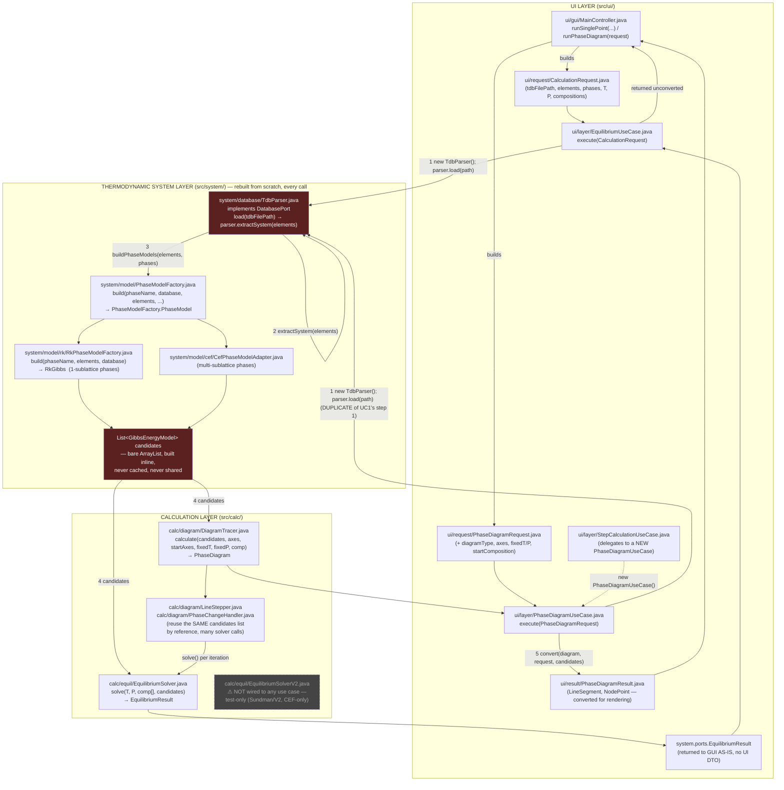
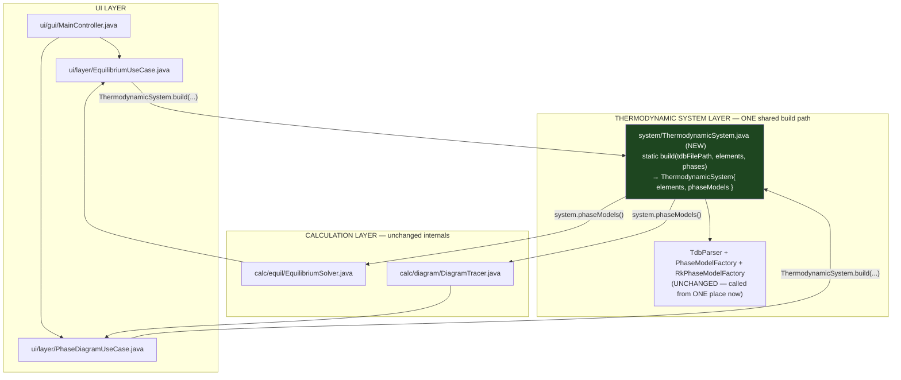

# Implement the documented Core Data Flow (UI → System → Calculation → UI)

## Current data flow (as-is, PNG figure)


*(Generated by `docs/gen_dataflow_figure.py`; re-run that script and re-embed
after any structural change to keep this figure in sync with the code.)*

The two-way interaction callout is grounded directly in Sundman, Dupin &
Hallstedt, *"Algorithms useful for calculating multi-component equilibria,
phase diagrams and other kinds of diagrams,"* CALPHAD 75 (2021) 102330 —
specifically Algorithm A (Fig. 1) and the Lagrangian Eq. (6)-(7), which
require **G_M^α(T,P,y)**, **M_A^α(y)** (moles of component A per formula
unit, Eq. 2), and their y-derivatives, evaluated per phase at every
iteration. In the current codebase that exact contract
(`siteEnergy`/`siteGradient`/`siteHessian`/`elementAmounts`/
`elementAmountsJacobian` on `GibbsEnergyModel`) is used **only by
`EquilibriumSolverV2`**, which — as the figure shows — is not wired into any
use case today. The legacy, production `EquilibriumSolver` instead uses an
older `evaluateG`/`gradient`/`hessian(x,T)` mole-fraction-space contract.
This is an important nuance for scoping this plan correctly: introducing
`ThermodynamicSystem` (Step 1 below) must stay solver-agnostic, since the
two solvers currently query the models through two different contracts, and
only one of them is actually Sundman's Algorithm A as published.

## Original current-flow sketch (Mermaid, superseded by the PNG above)



**Reading the red-highlighted nodes**: `TdbParser.load()` and the resulting
`candidates` list are the duplicated, never-cached path — `EquilibriumUseCase`
and `PhaseDiagramUseCase` each run steps 1-3 independently, from byte zero,
even for back-to-back calculations against the identical TDB file and phase
list. `EquilibriumSolverV2` (dashed, grey) is drawn to show it exists in the
Calculation Layer folder but has **no edge** into any use case today — it is
reachable only from its own test files.

## Target data flow (to-be, after this plan's Steps 1-2)



The only structural change is the introduction of `system/ThermodynamicSystem.java`
(green) as the single, shared entry point for "parse TDB + build phase
models" — both use cases call the same static factory instead of each
inlining the same five steps. Solver/tracer call sites, `PhaseModelFactory`,
`TdbParser`, and every model class (`RkGibbs`, `CefPhaseModelAdapter`, etc.)
are untouched.

## Context

`3layer_architecture.md` describes a target data flow: the UI turns user
input into a **problem object**; a **Thermodynamic System Layer** is
"activated once" to parse the database and build phase models, forming a
**thermodynamic system** that "remains fixed throughout the calculation";
this system plus the problem object are handed to a **Calculation Layer**
that runs a solver in a two-way loop against the system, and finally
produces a **result object** that flows back to the UI.

A direct investigation of the current code (`ui/layer/EquilibriumUseCase.java`,
`ui/layer/PhaseDiagramUseCase.java`, `system/model/PhaseModelFactory.java`,
`system/database/TdbParser.java`, `calc/equil/EquilibriumSolver.java`,
`calc/equil/EquilibriumSolverV2.java`) shows the codebase is closer to this
target than a from-scratch design would suggest, but has one concrete,
well-defined gap plus a few smaller inconsistencies:

**What already matches the doc:**
- Problem objects already exist: `ui/request/CalculationRequest.java`,
  `ui/request/PhaseDiagramRequest.java`, `ui/request/PropertyScanRequest.java`.
- `RkGibbs`/`CefPhaseModelAdapter` (via `GibbsEnergyModel`) already are the
  "Gibbs Model Sub-layer" — they provide G(T,y)/∂G/∂y/∂²G/∂y² per the doc's
  own naming (see `siteEnergy`/`siteGradient`/`siteHessian`), built once and
  immutable, exactly matching "built once per system, remains unchanged."
- `EquilibriumSolver.solve(T, P, comp[], List<GibbsEnergyModel>)` already has
  the right *shape* for a Calculation Layer module: it's a (mostly) pure
  function from (problem-ish scalars + phase-model list) to a result object
  (`system.ports.EquilibriumResult`), not a mutable service with hidden state.
- `PhaseDiagramUseCase.execute()` already does what the doc calls "the UI
  interprets the result object": it explicitly converts the internal
  `PhaseDiagram`/`DiagramLine`/`DiagramNode` graph into a UI-shaped
  `ui/result/PhaseDiagramResult.java` DTO before returning.

**The concrete gap — no persistent "Thermodynamic System" object:**
- `EquilibriumUseCase.execute()` (lines 57-94) and `PhaseDiagramUseCase.execute()`
  (lines 53-96) each independently do: `new TdbParser()` → `parser.load(path)`
  → `parser.extractSystem(elements)` → `system.buildPhaseModels(elements, phases)`
  → wrap each `PhaseModel` as a `GibbsEnergyModel`. This is the *exact same
  five-step sequence*, duplicated verbatim in both use cases, with no shared
  helper and no caching — every single calculation reloads and reparses the
  TDB file from disk and rebuilds every phase model from scratch, even for
  back-to-back calculations on the identical system.
- There is no class that represents "the collection of phase models for this
  system" as a first-class object — today it's a bare `List<GibbsEnergyModel>
  candidates`, constructed inline, never named, never reused. The doc calls
  this object "a thermodynamic system" and says it should be "activated once."
- `DiagramTracer` internally *does* reuse one `candidates` list across
  potentially hundreds of solver calls (passed by reference through
  `LineStepper`/`PhaseChangeHandler`/`InvariantHandler`), which is the
  "system stays fixed during one calculation" behavior working by accident of
  parameter threading — but only within the lifetime of one `execute()` call,
  never across independent calculations (e.g. a single-point calc followed by
  a diagram calc on the same TDB re-does everything from byte zero).

**Smaller inconsistencies worth fixing in the same pass (not the main
target, but touched by it):**
- `EquilibriumResult` lives in package `system.ports`, conceptually a
  Calculation Layer output, not a System Layer port — a naming/placement
  mismatch against the doc's layering, though not something to relocate
  broadly in this pass (would touch many files for cosmetic gain).
- `ui/result/CalculationResult.java` appears to be dead/legacy — no use case
  found that returns it (`SinglePointUseCase`/`EquilibriumUseCase` return
  `EquilibriumResult` directly, unconverted, straight to the GUI layer,
  unlike the diagram path). Confirm and either wire it in properly (convert
  `EquilibriumResult` → `CalculationResult` for the single-point path, to
  match the diagram path's UI-DTO-conversion pattern) or remove it if truly
  dead — decide during implementation, not up front.
- `EquilibriumSolverV2` (Sundman) is currently **not wired into any use case**
  — it's exercised only by its own test files
  (`VzrFixedTwoPhaseSundmanBaseline.java`,
  `EquilibriumSolverV2TwoPhaseEndToEndTest.java`). It is also CEF-only today
  (hard `instanceof CefPhaseModelAdapter` gate) and has an admittedly
  incomplete phase-initializer (its own javadoc says so). **This plan does
  NOT wire V2 into the UI flow or fix its CEF-only gate** — that is a
  separate, larger, already-identified follow-on (see
  "Explicitly out of scope" below). The Calculation Layer introduced here
  wraps the existing, production `EquilibriumSolver` (legacy/V1).

## Approach

Introduce one new class — `ThermodynamicSystem` — as the concrete embodiment
of the doc's "Thermodynamic System Layer," and refactor the two production
use cases to build it once and share the construction logic, instead of
duplicating the five-step sequence inline. Do not change any solver
internals, any phase-model class, or the RK/CEF model hierarchy — this is
purely a **wiring and object-introduction** change at the use-case layer.

### Step 1 — Introduce `ThermodynamicSystem` (System Layer)

New class, e.g. `src/system/ThermodynamicSystem.java`:

```java
public final class ThermodynamicSystem {
    private final List<String> elements;
    private final List<GibbsEnergyModel> phaseModels;  // built once, immutable list

    private ThermodynamicSystem(List<String> elements, List<GibbsEnergyModel> phaseModels) { ... }

    /** Builds a system by parsing tdbFilePath and constructing models for
     *  exactly the requested phases. This is the ONE place that does
     *  TdbParser -> extractSystem -> buildPhaseModels -> wrap-as-GibbsEnergyModel. */
    public static ThermodynamicSystem build(String tdbFilePath,
                                             List<String> elements,
                                             List<String> phases) throws IOException { ... }

    public List<GibbsEnergyModel> phaseModels() { return phaseModels; } // unmodifiable
    public List<String> elements() { return elements; }
}
```

This directly replaces the duplicated block (`new TdbParser()` ... `candidates`
list) currently inlined in both `EquilibriumUseCase.execute()` and
`PhaseDiagramUseCase.execute()`, folding the existing
`PhaseModelFactory.PhaseModel` → `GibbsEnergyModel` unwrapping
(`pm.toGibbsModel(elements)`) into the same place. No change to
`TdbParser`, `DatabasePort`, or `PhaseModelFactory` themselves — this class
is a thin, single-purpose orchestrator over what already exists.

### Step 2 — Update `EquilibriumUseCase` and `PhaseDiagramUseCase` to consume it

Replace the duplicated 5-step block in each `execute()` method with:
```java
ThermodynamicSystem system = ThermodynamicSystem.build(
        request.getTdbFilePath(), request.getElements(), request.getPhases());
```
then pass `system.phaseModels()` into the existing solver/tracer calls exactly
as `candidates` is used today — no change to solver call signatures. This is
a mechanical, behavior-preserving replacement: same values flow to
`EquilibriumSolver.solve()`/`DiagramTracer.calculate()` as before, just
assembled through one shared path instead of two copies.

`StepCalculationUseCase` (which today constructs its own `PhaseDiagramUseCase`
internally) needs no direct change — it inherits the fix by delegating.

### Step 3 — (Optional, only if Step 1-2 reveal it's easy) Session-level reuse

The doc's "built once... remains fixed throughout the calculation" is fully
satisfied by Steps 1-2 for the lifetime of *one* `execute()` call. Whether to
go further — caching a `ThermodynamicSystem` across multiple independent
use-case calls in the same UI session (e.g. `MainController` holds the last
built system and reuses it if the request's tdbFilePath/elements/phases are
unchanged) — is a genuine judgment call with UI-lifecycle implications
(cache invalidation when the user picks a different TDB file or phase list).
Recommend treating this as a follow-up decision after Steps 1-2 land and are
verified, not bundling it into this pass.

### Step 4 — Result-flow consistency (small, mechanical)

Confirm whether `ui/result/CalculationResult.java` is genuinely dead code
(no callers construct or return it). If dead, leave it alone unless asked to
clean it up (not this plan's purpose). If it's meant to be the single-point
analogue of `PhaseDiagramResult`, wire `SinglePointUseCase`/`EquilibriumUseCase`
to convert `EquilibriumResult` → `CalculationResult` before returning to the
GUI, matching the diagram path's existing "system converts to UI DTO"
pattern. This is a smaller, separable decision — flag it, confirm the actual
call sites during implementation, and only change it if it's a clean,
low-risk win; do not force it if it turns out `EquilibriumResult` is already
relied upon as-is elsewhere in the GUI layer.

## Explicitly out of scope for this pass

- **`EquilibriumSolverV2` wiring** (retyping `PhaseWork.model` from concrete
  `CefPhaseModelAdapter` to `GibbsEnergyModel`, relaxing its `instanceof`
  gate, hooking it into any use case) — separate, larger, already-identified
  follow-on from the RK/CEF merge work. `ThermodynamicSystem` is solver-
  agnostic (it just produces `List<GibbsEnergyModel>`), so it will work
  with V2 unchanged whenever that follow-on happens — no rework needed here.
- **Relocating `EquilibriumResult`** out of `system.ports` — cosmetic,
  touches many files, no functional benefit; not part of this pass.
- **Any change to `PhaseModelFactory`, `TdbParser`, `RkGibbs`, `CefGibbs`,**
  or any model/database-layer class — this plan only touches the use-case
  layer and adds one new orchestrating class.

## Verification

- Compile the whole project via the standard `javac` sweep (Gradle wrapper
  incompatible with installed JDK).
- Re-run existing UI-facing integration coverage if any exists for
  `EquilibriumUseCase`/`PhaseDiagramUseCase` (check `src/test/` for use-case-
  level tests before assuming none exist).
- Manually trace (or write a small smoke test) confirming
  `EquilibriumUseCase.execute()` and `PhaseDiagramUseCase.execute()` produce
  bit-identical results before/after the refactor for the same request (same
  TDB, same elements/phases/T/P/composition) — this should be a pure
  refactor with zero numerical change, since the same `GibbsEnergyModel`
  instances (same construction path, same data) reach the same solver calls.
- Confirm `DiagramTracer`'s existing behavior (many solver calls sharing one
  candidates list within a single diagram calculation) is unaffected —
  `ThermodynamicSystem.phaseModels()` is passed once at the top of
  `PhaseDiagramUseCase.execute()`, same as today's `candidates` list.
